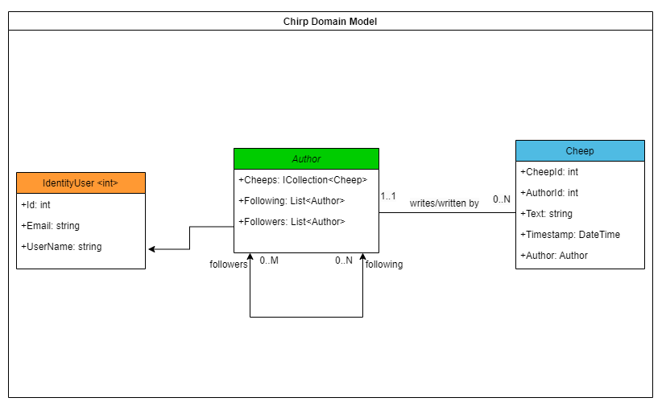
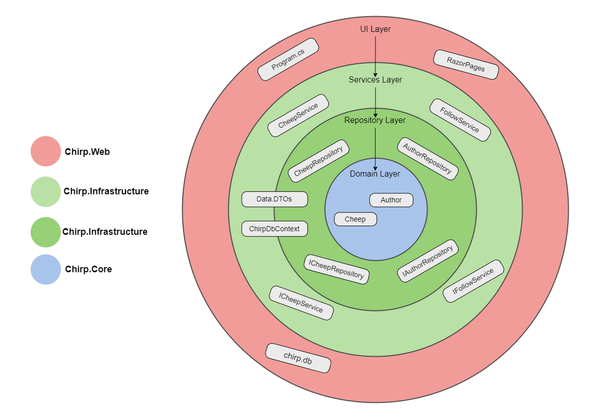
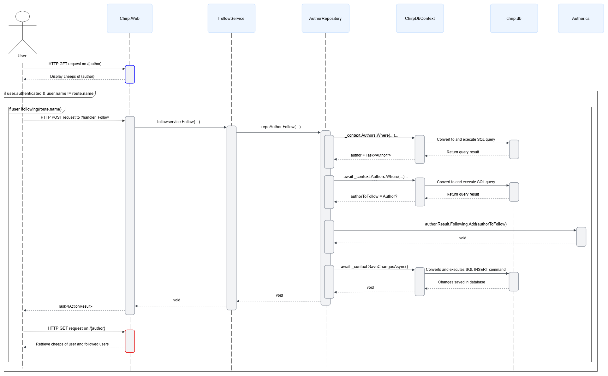

<a id="design"></a>
# Design and Architecture of _Chirp!_

## Table of contents:

- [Domain model](#domain-model)
- [Architecture - In the small](#architecture-small)
- [Architecture of deployed application](#architecture)
- [User activities](#user-activities)
- [Sequence of functionality/calls trough _Chirp!_](#functionality-calls)
- [Process](#Process)
- [Build, test, release, and deployment](#btrd)
- [Team Work](#team-work)
  - [Description of the group’s workflow](#group-workflow)
- [How to make _Chirp!_ work locally](#work-locally)
- [Releases](#releases)
  - [For Windows](#for-windows)
  - [For MacOS X](#for-mac)
- [Git Cloning](#git-cloning)
  - [In the Terminal/Command Prompt](#terminal)
- [How to run test suite locally](#run-tets)
- [Ethics](#ethics)
  - [License](#license)
  - [LLMs, ChatGPT, CoPilot, and others](#llms)
 


<a id="domain-model"></a>
## Domain model



The Domain Model for the Chirp application is implemented in the Chirp.Core package, which is the innermost layer in our Onion Model. This model consists of two main classes/entities: Author and Cheep, which define the essential components, core behavior and structure of the application. 

Author represents a user and extends from the IdentityUser class from Asp.Net.Core Identity, allowing functionality such as authenticating a user. As seen above in the diagram, an Author automatically inherits an Id (int), an Email (string) and a username (string). Furthermore, an Author has a relation to Cheep by storing a Collection of cheeps the user has written. This ensures that every Cheep is written by only one Author, but an Author can write many Cheeps, making it a one-to-many relationship. Finally, the Author class stores two Lists, which contain the other Authors which the user is either following or followed by.

The Cheep object represents the structure for individual posts created by an authorizeded user. It contains a unique identifier CheepId (int), a foreign key AuthorId (int) and an Author of type Author, associated with an existing user. It also contains Text (string), which is the content of the post with a maximum length of 160 characters. Lastly, it contains a Timestamp (DateTime), which is the registered time and date of when the cheep was posted.

<a id="architecture-small"></a>
## Architecture — In the small



The Chirp Application is designed following The Onion Architecture, which to some extent ensured separation of concerns and testability in our project. The architecture is implemented across three solutions:

1.	Chirp.Core (Domain Layer):
As the innermost layer, this solution is responsible for defining the entities (Cheep, Author). This layer is seen in detail in the domain model. Being the core of the layer makes it completely independent of external dependencies, only providing the foundation upon which all other layers build.

2.	Chirp.Infrastructure (Repository and Services Layers): 
This solution has two important layers. The Repository Layer implements the methods of the entities, making them dependent on the Domain Layer. The Services Layer primarily interacts with the repositories and thereby also the Domain Layer. Furthermore, the Infrastructure solution also consists of our ChirpDbContext, which acts as a bridge, integrating the Domain Model with the actual database (chirp.db) in the UI Layer.
 
3.	Chirp.Web (UI Layer):
The outermost layer of the Onion Architecture is implemented in the Chirp.Web solution and handles all user interaction through Razor Pages while interacting with the DTOs and Services. Located here is also the application’s Program.cs, that sets up dependency injection and serves as the entry point for HTTP requests. 

<a id="architecture"></a>
## Architecture of deployed application

<a id="user-activities"></a>
## User activities

<a id="functionality-calls"></a>
## Sequence of functionality/calls through _Chirp!_
In the following section, a selection of the implemented functionality will be presented with the aid of sub-system sequence diagrams. The diagrams show the roles of the different components and languages in the project, while also providing a more in-depth look into the "onion" architecture.

<a id="public-timeline"></a>
### Accessing the Public Timeline

The entry point to _Chirp!_ is the public timeline. The diagram shows the sequence of calls required to display the cheeps in the database to an unauthenticated user. 

<a id="follow"></a>
### Follow (and unfollow)

This diagram illustrates the call sequence to follow another user. The blue and red containers represent longer functionality sequences, much like the one shown in **"Accessing the Public Timeline"** above. Unfollowing a user requires access to the same components, differing only in a few methods.

<a id="forget-me"></a>
### Forget me

Lastly, the above diagram illustrates the sequence of calls required to delete a user from _Chirp!_. Our implementation of the "Forget Me" feature attempts to be GDPR compliant by:
1. Deleting the user from the UserManager
2. Removing the user from the followers lists of its followers
3. Removing all cheeps authored by the user
4. Executing the DELETE operation on the row in the database with the user's information
5. Signing the user out after the above operations
6. All the above operations happen without any unnecessary delays
<br>

<a id="process"></a>
# Process

<a id="btrd"></a>
## Build, test, release, and deployment
Our program is automatically built, tested, and run through the following three Github Actions Workflows:

<a id="test-workflow"></a>
### Build and Test Workflow


This workflow shows how we automatically build and test our program on all branches whenever we push our commits or accept a pull request. This helps keep us on track with testing.

<a id="release-workflow"></a>
### Release Workflow


This workflow shows how we automatically create releases for the three major operating systems. These releases allow a user to download and run the program locally from their own computer. The workflow is triggered by the creation and push of a new tag of the form “v*.*.*” (RegEx: the asterisks represents any number/character). The entire project is compressed into single file executables for each OS, and then further compressed together with the static files into zip files. These, together with the source code in zip and tar.gz files are released to GitHub under the version number.

The details of building the program have been left out here, as they are shown in the build and test workflow.

<a id="deployment-workflow"></a>
### Deployment Workflow


This workflow illustrates how we deploy our program to Azure. This workflow is almost entirely built by Azure, we have simply modified it to suit the specifics of our program. The workflow is triggered by either a push or pull to the primary branch.

THe details of building and testing the program have also been left out here, as they are shown in the build and test workflow.

<a id="team-work"></a>
## Team work


Our project board columns have been adjusted throughout this course, due to our needs varying from week to week. In the beginning of the course we were still learning to structure our time correctly, so we had columns for previous weeks that included issues we had not managed to finish before the beginning of a new week. However, with a bit of extra effort we caught up and for the last half of the course we have only had work for the current week to complete. This can be seen in the image above. 

As can also be seen above, some issues have not yet been completed. This is due to us constantly improving our project these last few days, so occassionally new warnings pop up, and tests need to be adjusted. These issues have therefore been ongoing for longer periods of time, and have been moved back and forth between the in progress and completed columns. There are also some issues on the board which reflect the status of our report at the moment of us writing this section. 


This is how our group tackled the weekly project work. As can be seen from the diagram, the flow in the blue box was used repeatedly throughout the week, as this is how we structured our work in smaller groups when working directly on the project.

We followed the standard pair programming strategies well throughout the weeks, and enjoyed how efficient we found this to be. As can also be seen in many of our initial commits, we did sometimes spend the days working all of us together on the project work. This was often due to certain tasks needing to be performed sequentially, otherwise the project would not be cohesive. Additionally, we enjoyed the productive discussions that sprung from this team-working style. 

We also enjoyed showing eachother our work by conducting scrum-style code run-throughs when meeting up  all together, as this helped us all stay up to date on the code, even the parts we had not written ourselves. This also allowed for inputs on how to improve certain parts of the code in terms of efficiency, better readability or to follow the correct architectural design models.

<a id="work-locally"></a>
## How to make _Chirp!_ work locally

<a id="using-release"></a>
### Using a release

<a id="for-windows"></a>
#### For Windows

1. Go to our [GitHub repo](https://github.com/ITU-BDSA2024-GROUP28/Chirp).
2. Click on the newest release of Chirp! found under Releases
3. Download the zip file for Windows OS
4. After the downloaded completes, right click the zip file and extract the files.
5. After the files have beem extracted, run the "Chirp.Web.exe"
6. The terminal should now show a lot of text. Find the sentence "Now listening on: http​://localhost:XXXX" and note the port number.
7. Click the link or type this URL into your web browser and press enter to open the Chirp! web app.
8. You should be able to see the "Public timeline" with several cheeps displayed.
9. Press the reigster button in the navigation bar and register using Github or use your private email and username, and create a password.
10. You should now be able to freely explore Chirp!

<a id="for-mac"></a>
#### For MacOS X

1. Go to our [GitHub repo](https://github.com/ITU-BDSA2024-GROUP28/Chirp). 
2. Click on the newest release of Chirp! found under Releases.
3. Download the zip file for MacOS.
4. After the downloaded completes, double click the zip file and extract the folder.
5. After the folder have beem extracted, right click the folder and select "New terminal at folder".
6. Type the following command into the terminal:
```
sudo ./Chirp.Web
```
7. Enter the password for your device when prompted, and press enter.
8. If you receive the warning "'Chirp.Web' cannot be opened because the developer cannot be verified" follow these steps to bypass it.

   a. Close the warning by pressing "Cancel".

   b. Go to "System Preferences" on your Mac.

   c. Click on "Privacy and Security".

   d. Scroll to "Security".

   e. You should see a message saying "Chirp.Web was blocked from opening because it is not from an identified developer."

   f. Click on the "Allow Anyway" next to it.

   g. Go back to the terminal and type the same command into the terminal:
   ```
   sudo ./Chirp.Web
   ```
   
   h. Enter the password for your device when prompted, and press enter.
   
9. If a new warning shows up saying: "macOS cannot verify the developer of “Chirp.Web”. Are you sure you want to open it?" Press "Open".
10. The terminal should now show a lot of text. Find the sentence "Now listening on: http​://localhost:XXXX" and note the port number.
11. Click the link or type this URL into your web browser and press enter to open the Chirp! web app.
12. You should be able to see the "Public timeline" with several cheeps displayed.
13. Press the reigster button in the navigation bar and register using Github or use your private email and username, and create a password.
14. You should now be able to freely explore Chirp!

<a id="git-cloning"></a>
### Using git cloning

In the **Terminal**:

1. Open a new terminal/command prompt in the folder you would like to contain Chirp, enter:

```
git clone https://github.com/ITU-BDSA23-GROUP16/Chirp.git
```

2. After the cloning process has completed, navigate into the project directory using:

```
cd Chirp
```

3. You may need to set the correct clientId and clientSecret before running. Use the following commands:

```
dotnet user-secrets init --project src/Chirp.Infrastructure
```

```
dotnet user-secrets set "authentication_github_clientId" "<clientId" --project src/Chirp.Infrastructure
```

```
dotnet user-secrets set "authentication_github_clientSecret" "<clientSecret>" --project src/Chirp.Infrastructure
```

4. Run the project by entering:

```
dotnet run --project src/Chirp.Web.
```
<a id="run-tests"></a>
## How to run test suite locally
If you do not have playwright installed, please follow these steps first:

1. From our Chirp repo, go to playwright testing directory
```
cd test
cd PlaywrightTests
```
3. Build the project
```
dotnet build
```
5. Install playwright using this command
```
pwsh bin/Debug/net8.0/playwright.ps1 install
```

Then, to run test locally, follow these steps. 

1. Clone the Chirp project repository (see [git cloning](#git-cloning))

2. Open your terminal

3. Find the Chirp directory using the command
```
cd <path to chirp>/Chirp/
```
4. Type in the command
```
dotnet test
```
5. This should run unit tests, integration tests and playwright test

_Please note that the formatting of time stamps on different OS may cause the test "" to fail._

<a id="ethics"></a>
# Ethics

<a id="license"></a>
## License
For this project our group chose to use the MIT license. Due to most of the packages we use being licensed under MIT, this was the most logical choice. Moreover, we value the simplicity of the license, as we are not experienced in using licenses, and as developers we appreciate the flexibility and freedom this allows. The license gives any person “without limitation the rights to use, copy, modify, merge, publish, distribute, sublicense, and/or sell copies of the Software” under the condition that the copyright notice and the permission of MIT license is included in all copies. [source]

[source] our license is chosen from [choosealicense.com](https://choosealicense.com/licenses/mit/), see file [LICENSE.md](https://github.com/ITU-BDSA2024-GROUP28/Chirp/blob/Ethics/LICENSE.MD)

<a id="llms"></a>
## LLMs, ChatGPT, CoPilot, and others
We have used the LLM ‘ChatGPT’ a couple of times. We have made sure to mention this in our commits whenever we have done so. Each time the purpose was to gain a new perspective on a problem that had us stumped. However, it has almost always been more helpful and beneficial to ask classmates or TAs, we only resorted to the LLM when they were not available to assist. Whenever we did ask the LLM for help, it would only speed up our work approximately 50% of the time. The remaining 50% of the responses it gave to our prompts were mostly, if not entirely, useless.

