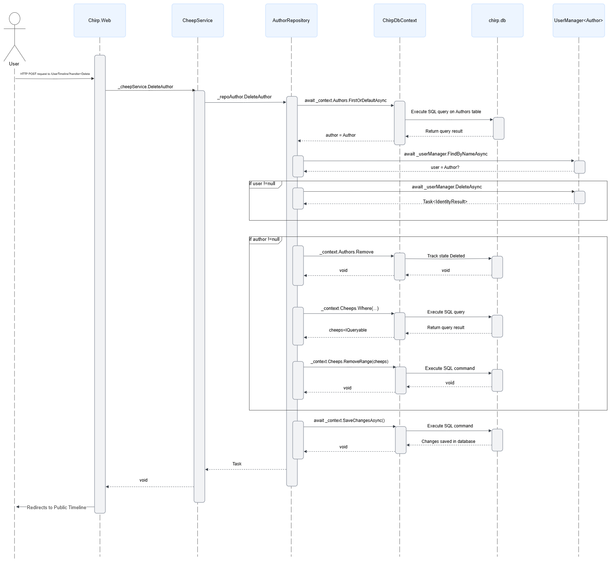
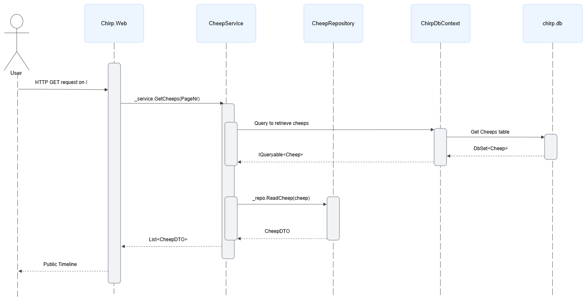
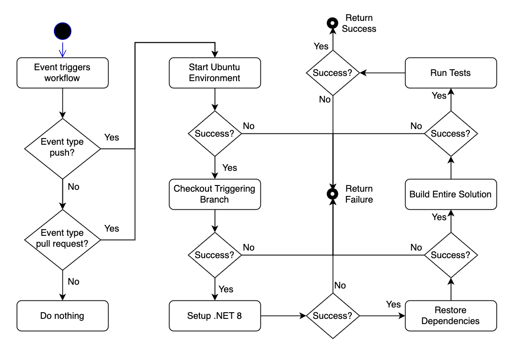
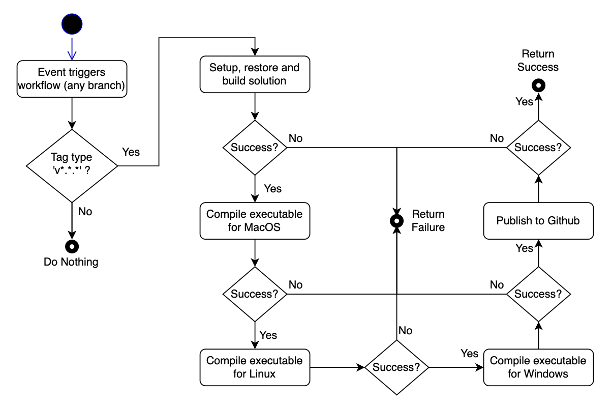
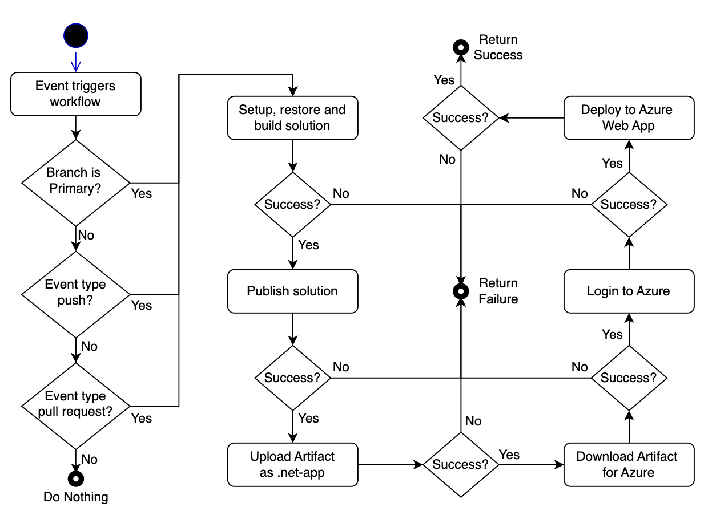
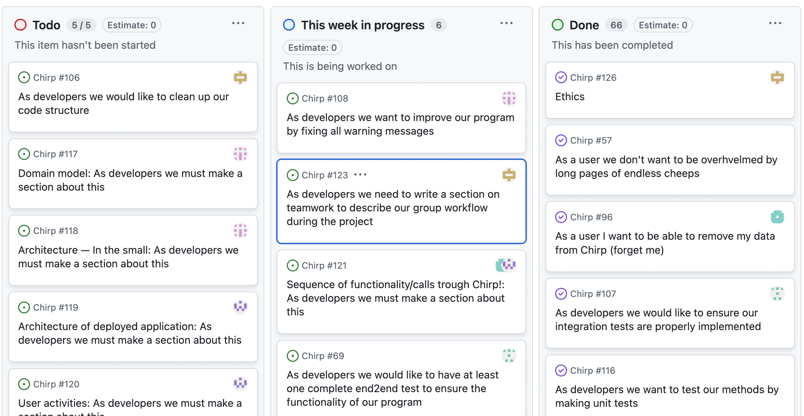
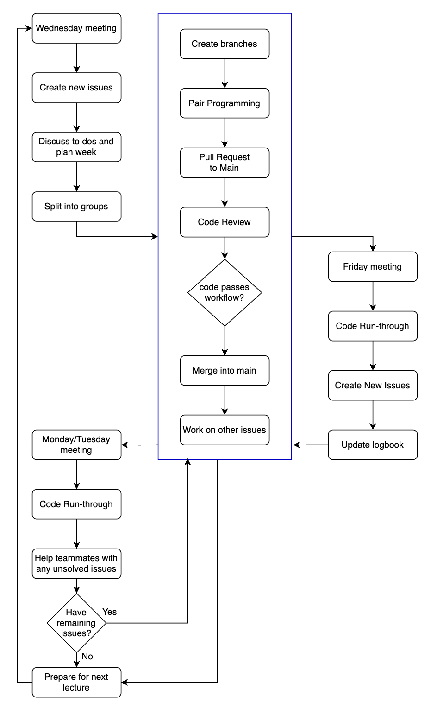

# Design and Architecture of _Chirp!_

## Domain model

Here comes a description of our domain model.

## Architecture — In the small

## Architecture of deployed application

## User activities

## Sequence of functionality/calls trough _Chirp!_

And

# Process

## Build, test, release, and deployment
Our program is automatically built, tested and run through the following three Github Actions Workflows

### Build and Test Workflow

This workflow shows how we automatically build and then test our program on all branches whenever we push our commits or accept a pull request. This helps keep us on track with testing.

### Release Workflow

This workflow shows how we automatically create releases for the three major operating systems. These releases allow a user to download and run the program locally from their own computer. The workflow is triggered by the creation and push of a new tag of the form “v*.*.*” (RegEx: the asterisks represents any number/character). The entire project is compressed into single file executables for each OS, and then further compressed together with the static files into zip files. These, together with the source code in zip and tar.gz files are released to GitHub under the version number.

The details of building the program have been left out here, as they are shown in the build and test workflow.

### Deployment Workflow

This workflow illustrates how we deploy our program to Azure. This workflow is almost entirely built by Azure, we have simply modified it to suit the specifics of our program. The workflow is triggered by either a push or pull to the primary branch.

THe details of building and testing the program have also been left out here, as they are shown in the build and test workflow.

## Team work

Our project board columns have been adjusted throughout this course, due to our needs varying from week to week. In the beginning of the course we were still learning to structure our time correctly, so we had columns for previous weeks that included issues we had not managed to finish before the beginning of a new week. However, with a bit of extra effort we caught up and for the last half of the course we have only had work for the current week to complete. This can be seen in the image above. 

As can also be seen above, some issues have not yet been completed. This is due to us constantly improving our project these last few days, so occassionally new warnings pop up, and tests need to be adjusted. These issues have therefore been ongoing for longer periods of time, and have been moved back and forth between the in progress and completed columns. There are also some issues on the board which reflect the status of our report at the moment of us writing this section. 

This is how our group tackled our weekly project work. As can be seen from the diagram, the flow in the blue box was used repeatedly throughout the week, as this is how we structured our work in smaller groups when working directly on the project.

We followed the standard pair programming strategies well throughout the weeks, and enjoyed how efficient we found this to be. As can also be seen in many of our initial commits, we did sometimes spend the days working all of us together on the project work. This was often due to certain tasks needing to be performed sequentially, otherwise the project would not be cohesive. Additionally, we enjoyed the productive discussions that sprung from this team-working style. 

We also enjoyed showing eachother our work by conducting scrum-style code run-throughs when meeting up  all together, as this helped us all stay up to date on the code, even the parts we had not written ourselves. This also allowed for inputs on how to improve certain parts of the code in terms of efficiency, better readability or to follow the correct architectural design models.

## How to make _Chirp!_ work locally

### Using a release

### Using github cloning

## How to run test suite locally

# Ethics

## License
For this project our group chose to use the MIT license. Due to most of the packages we use being licensed under MIT, this was the most logical choice. Moreover, we value the simplicity of the license, as we are not experienced in using licenses, and as developers we appreciate the flexibility and freedom this allows. The license gives any person “without limitation the rights to use, copy, modify, merge, publish, distribute, sublicense, and/or sell copies of the Software” under the condition that the copyright notice and the permission of MIT license is included in all copies. [source]

[source] our license is chosen from [choosealicense.com](https://choosealicense.com/licenses/mit/), see file [LICENSE.md](https://github.com/ITU-BDSA2024-GROUP28/Chirp/blob/Ethics/LICENSE.MD)

## LLMs, ChatGPT, CoPilot, and others
We have used the LLM ‘ChatGPT’ in a few cases. We have made sure to mention this in our commits whenever we have done so. In all cases the purpose was to give a new perspective on a problem that had us stumped.  However, it has almost always been more helpful and beneficial to ask classmates or TAs, we only resorted to the LLM when they were not available to assist. Whenever we did ask the LLM for help, it would only speed up our work approximately 50% of the time. The remaining 50% of the responses it gave to our prompts were mostly, if not entirely, useless.

